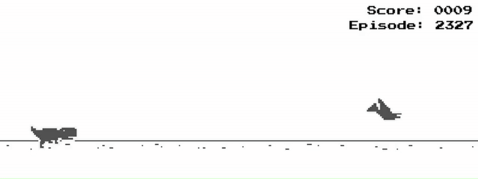
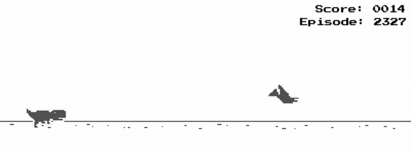
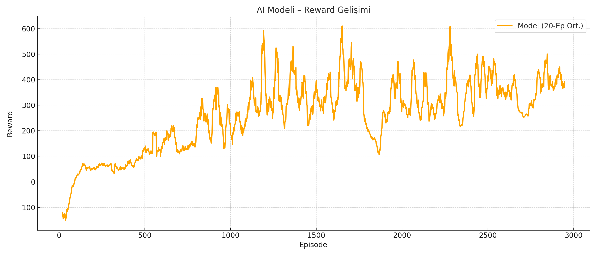

# 🧠 Dino Game AI – DQN Agent

This project presents an AI agent trained using **Deep Q-Network (DQN)** to play the Chrome Dino game autonomously. The agent learns how to jump or duck to avoid obstacles and maximize its score.




## 🎯 Project Goals

- Develop an environment simulating the Chrome Dino game
- Implement a Deep Q-Learning agent
- Train the agent to learn the best action (jump/duck/do nothing)
- Visualize reward progression and performance

---

## 🧠 Technologies & Libraries

- Python 3.9+
- TensorFlow / PyTorch (whichever you used)
- NumPy
- OpenAI Gym-style custom environment
- Pygame (for rendering)
- Matplotlib (for reward/loss plots)

---

## 📁 Project Structure

```
project-root/
│
├── assets/                 # Dino game sprites and UI
├── game.py                # Dino game
├── dino_env.py            # Custom OpenAI Gym-like environment
├── dqn_agent.py           # DQN agent and model definition
├── train_dino.py          # Training loop and logging
├── reward_log.json        # Training reward log
└── README.md
```

---

## 🏁 How It Works

1. **State Representation:**
   - Dino’s position
   - Distance to next obstacle
   - Obstacle height/type
   - Game speed

2. **Actions:**
   - 0 = Do nothing  
   - 1 = Jump  
   - 2 = Duck

3. **Reward System:**
   - +1 for surviving each frame  
   - -100 on collision  
   - +10 on obstacle avoidance

---

## 🚀 How to Train the Model

```bash
pip install -r requirements.txt
python train_dino.py
```
---

## 📊 Example Results

- Training episodes: 1000+
- Reward trend: Upward slope as learning progresses
- AI successfully avoids obstacles and reacts dynamically



---

## 🙋 Author

**Eren Türköz**  
[GitHub](https://github.com/Erenturkoz) • [LinkedIn](https://linkedin.com/in/erentürköz)

---

> Built for academic purposes and experimentation with reinforcement learning 🧪
